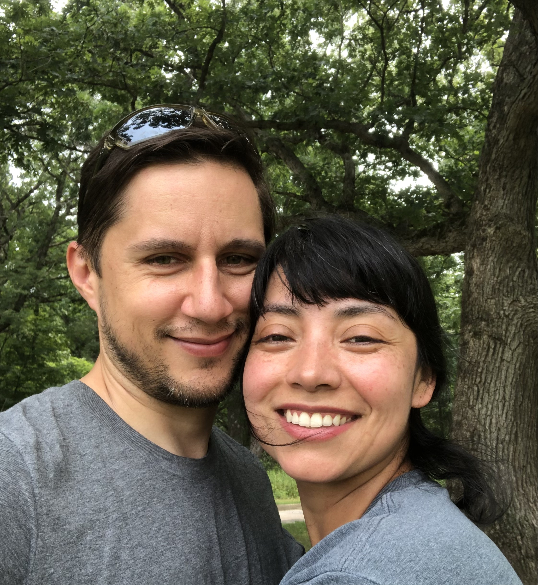

    

      

          <h2 class="blog-title">Eric Chrobak</h2>
          
          
Eric has cultivated his passion for technology to help small businesses use technology to solve issues and grow. Previously, grew company 50% over 2 years. Using Ruby, JavaScript, Zoho Deluge, HTML, CSS, etc. Currently works at <a href="www.vaspian.com">Vaspian</a>
 
      
       
      <ul class="blog">
        
          <li class="article">
            <h2>{{ post.title }}</h2>
            
{{ post.date | date: "%B %-d, %Y" }}

            
{{ post.excerpt | strip_html | strip_newlines | truncate: 300 }}

            <button class ="blog-button" type="button"><a href="{{ post.url }}">Read More</a></button>
          </li>
        
      </ul>
    

