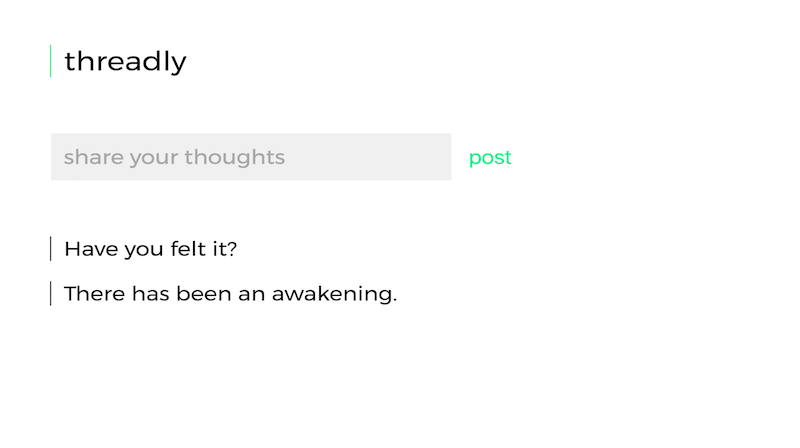
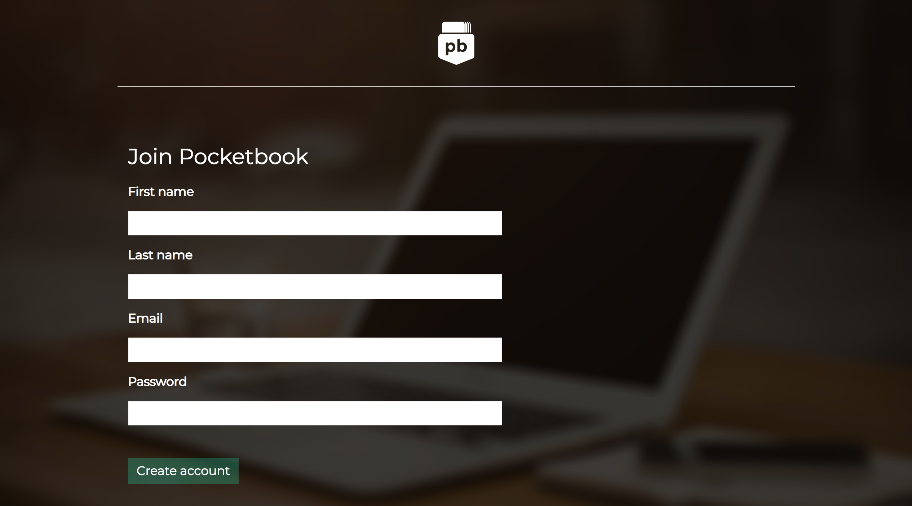

<!-- Project Showcase -->

    

        <h1 class="intro">Web Development Solutions for Business</h1>
        <!--Slideshow-->
        

            <!-- Indicators -->
            <ol class="carousel-indicators">
                <li data-target="#carousel-example-generic" data-slide-to="0" class="active"></li>
                <li data-target="#carousel-example-generic" data-slide-to="1"></li>
                <li data-target="#carousel-example-generic" data-slide-to="2"></li>
            </ol>

            <!-- Wrapper for slides -->
            

                

                    
                

                

                    
                

                

                    
                

            

            <!-- Controls -->
            <a class="left carousel-control" href="#carousel-example-generic" role="button" data-slide="prev">
                
                Previous
            </a>
            <a class="right carousel-control" href="#carousel-example-generic" role="button" data-slide="next">
                
                Next
            </a>
        

        <!-- 

 -->
    

<!-- End Showcase -->

<!-- Supporting Section -->

    

        <ul class="nav nav-pills" id="supporting-nav">
            <li class="nav-all active"><a href="#work">All</a></li>
            <li class="nav-html"><a href="#work">HTML/CSS/JS</a></li>
            <li class="nav-ruby"><a href="#work">Ruby</a></li>
        </ul>

        

            <!--These are the modal windows-->
            

            <!-- Thumbnails -->
            

                
                
                
            

            

                
                
                
            

            

                
                
                
            

        

    

<!--End Supporting-->
